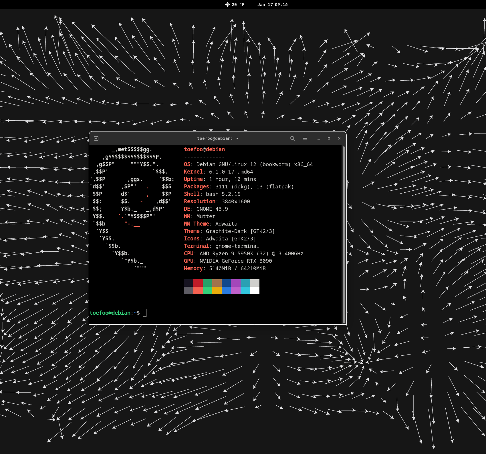

# Themes For Debian Desktop

Right now I'm using Graphite Dark on Gnome and it's very nice.

* Font: Jetbrains Mono
* Appearance: Dark
* Wallpaper: Topographic Map Wallpaper (use vector if you have ultrawide)
* Weather: Gnome OpenWeather Extension

